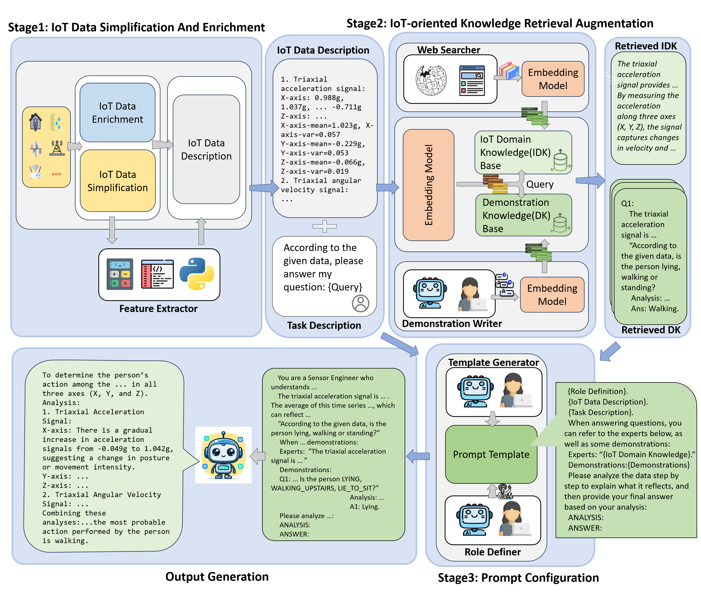

# IoT-LLM: Enhancing Real-World IoT Task Reasoning with Large Language Models

## Framework Overview
   

## Install
```bash
git clone https://github.com/Morpheus-An/IoT-Agent.git

cd IoT-Agent
pip install -r requirements.txt
```

## IoT-Agent Directory Structure
```
IoT-Agent/
├── data/
│   ├── ECG
│   ├── IMU
│   ├── machine_detect
│   └── ...
├── Images/
├── common/
│   ├── args.py
│   ├── data_calibration.py
│   ├── generate_prompt.py
│   ├── model.py
│   ├── read_data.py
│   └── utils.py
├── pipeline_pictures/
├── knowledge/
│   ├── ecg_detection/
│   |   ├── demo-knowledge/
│   |   └── domain-knowledge/
│   ├── imu_HAR/
│   |   ├── demo-knowledge/
│   |   └── domain-knowledge/
│   ├── machine_detection/
│   |   ├── demo-knowledge/
│   |   └── domain-knowledge/
|   └── ...
├── models/
|   ├── LLaMa2-7b-32k/
|   └── Mistral-7b-instruct-v0.3/
├── results/
├── imports.py
├── requirements.txt
├── openAI_API_key.py
├── main.py
├── run.sh
└── README.md
```

